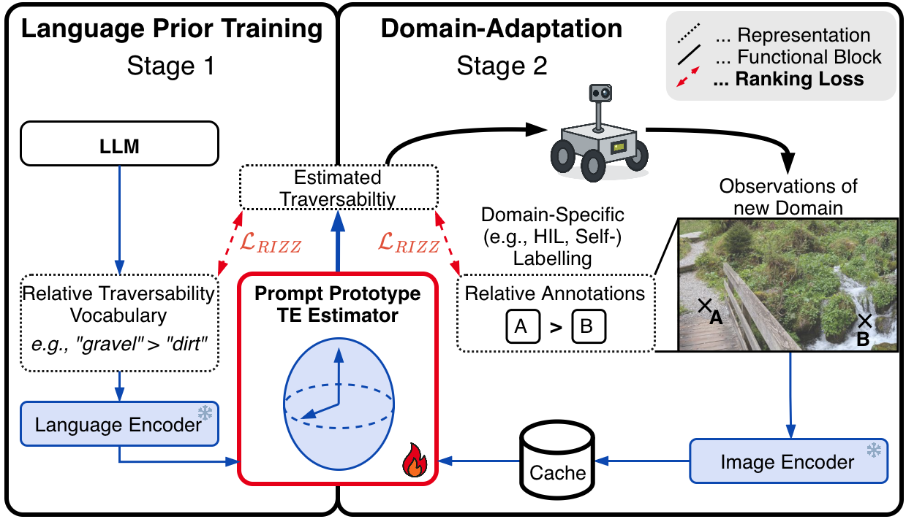

<h1 align="center">
From Language Priors to Field Adaptation: Preference Learning for Traversability Estimation
</h1>

<h3 align="center">
Simon Schwaiger1,2, David Seyser2, Alessandro Scherl2,3, Zlatan Ajanović2, Wilfried Wöber4, Gerald Steinbauer-Wagner1
</h3>

1Graz University of Technology 
2University of Applied Sciences Technikum Wien 
3University of Alicante 
4University of Natural Resources and Life Sciences Vienna

📄 <a href="https://arxiv.org/abs/2610.02974">Paper Preprint</a> |
🌐 <a href="https://resireg.github.io">resireg.github.io</a>

***************************************

## 📰 News

* [05.10.2026] Paper preprint release.

***************************************

## 🧭 Method

  

We introduce a preference-learning approach for traversability estimation that starts from language-based priors and adapts them to field data using relative traversability annotations. Instead of training an application-specific prediction head, traversability is modeled directly in the vision-language feature space using von Mises-Fisher mixture responsibilities, enabling data-efficient adaptation to new environments.

***************************************

## 💻 Code

Code and trained traversability estimators will be released here.
